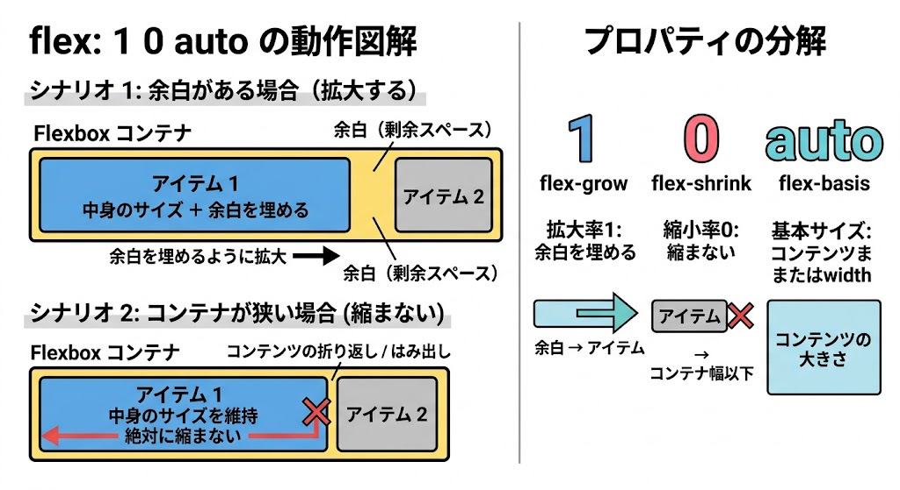

# MEMO

## ブロック要素とインライン要素

- ブロック要素
  - div
- インライン要素
  - span

## vuetify レイアウト系

- v-main
- https://zenn.dev/bbled/books/vuetify3_book/viewer/sec1_7
  - div
  - v-container
  - v-card
  - v-sheet

### v-main

- v-main
  - `flex: 1 0 auto`がついている
    - 1
      - flex-grow: 1
    - 0
      - flex-shrink: 0
    - auto
      - flex-basis: auto

CSSの `flex: 1 0 auto;` は、Flexbox（フレックスボックス）のアイテムが「どのように伸縮するか」を決める3つのプロパティを同時に指定するショートハンド（一括指定）です。

結論から言うと、この指定は「中身に合わせてサイズを決めつつ、余ったスペースがあれば目一杯広がる（縮みはしない）」という意味になります。

それぞれの数字やキーワードが持つ意味を分解して解説します。

---

### 💡 3つの値の正体

`flex: 1 0 auto;` は、左から順に以下のプロパティに対応しています。

1. **`flex-grow: 1`**（伸びる比率）
2. **`flex-shrink: 0`**（縮む比率）
3. **`flex-basis: auto`**（ベースとなるサイズ）

---

### 🔍 各プロパティの詳しい意味

#### ① `flex-grow: 1` （伸びる）

- **意味:** コンテナ（親要素）に余白がある場合、その余白をどれだけ分け合って**伸びるか**の比率です。
- **`1` の効果:** 余ったスペースを埋めるように、限界まで引き伸ばされます。

#### ② `flex-shrink: 0` （縮まない）

- **意味:** コンテナの幅が狭くなり、アイテムが入り切らなくなったときに、どれだけ**縮むか**の比率です。
- **`0` の効果:** 「絶対に縮まない」という意味になります。そのため、親要素をはみ出してでも、設定されたサイズを維持します。

#### ③ `flex-basis: auto` （基本サイズ）

- **意味:** 伸縮計算のベース（基準）となる**最初のサイズ**です。
- **`auto` の効果:** アイテム自体の幅（`width` や `height` の指定値）、またはその中に入っている**文字や画像などのコンテンツの大きさ**を基準にします。

---

### 🛠 具体的にどんな挙動になる？

この3つが合わさることで、以下のような挙動になります。

- **スペースが余っているとき:** `flex-basis: auto` で中身のサイズを確保した上で、`flex-grow: 1` が効くため、**画面幅いっぱいにグッと広がります。**
- **スペースが足りないとき:** `flex-shrink: 0` が効いているため、画面が狭くなっても**中身が潰されず、テキストの折り返しや要素のはみ出しが発生してサイズを死守します。**

### ✍️ よくある活用シーン

ヘッダーやフッター、カード型レイアウトなどで、「特定の要素（ボタンやアイコンなど）だけは絶対に潰したくないけれど、余白があるときは右側まで目一杯広がってほしい」というパーツを作る際によく使われます。

- 
