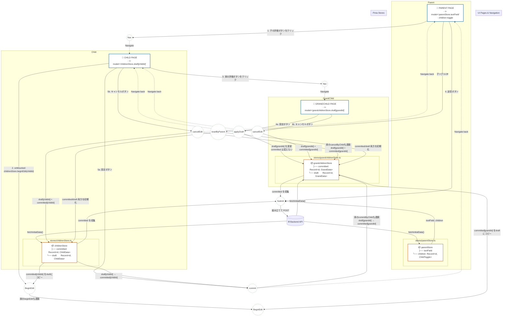

```mermaid
graph TD
    classDef page fill:white,stroke:#01579b,stroke-width:2px;
    classDef store fill:white,stroke:#e65100,stroke-width:2px;
    classDef action fill:white,stroke:#2e7d32,stroke-width:1px,stroke-dasharray: 5 5;

    %% 画面（UI）レイヤー
    subgraph UI_Pages [UI Pages & Navigation]
    end

    subgraph Parent
        ParentPage["📱 PARENT PAGE<br>- v-model='parentStore.textField'<br>- children toggle"]:::page

        subgraph Parent_Scope [stores/parentStore.ts]
            parentStore["📦 parentStore<br>├── textField<br>└── children: Record&lt;id, ChildToggle&gt;"]:::store
        end
    end
    subgraph Child
        ChildPage["📱 CHILD PAGE<br>- v-model='childrenStore.draft[childId]'"]:::page

        subgraph Child_Scope [stores/childrenStore.ts]
            childrenStore["📦 childrenStore<br>├── committed: Record&lt;id, ChildData&gt;<br>└── draft:      Record&lt;id, ChildData&gt;"]:::store
        end
    end

    subgraph GrandChild

        GrandchildPage["📱 GRANDCHILD PAGE<br>- v-model='grandchildrenStore.draft[grandId]'"]:::page
        subgraph Grand_Scope [stores/grandchildrenStore.ts]
            grandchildrenStore["📦 grandchildrenStore<br>├── committed: Record&lt;id, GrandData&gt;<br>└── draft:      Record&lt;id, GrandData&gt;"]:::store
        end
    end

    %% ストア（Pinia）レイヤー
    subgraph Pinia_Stores [Pinia Stores]


    end

    API[("🌐 Backend API")]

    %% --- 初期データ取得 ---
    API -->|"fetchInitialData()"| parentStore
    API -->|"fetchInitialData()"| childrenStore
    API -->|"fetchInitialData()"| grandchildrenStore

    %% --- 親 → 子への遷移 ---
    ParentPage -->|"1. 子の詳細ボタンをクリック"| Nav1((Nav)):::action
    Nav1 -.->|Navigate| ChildPage
    ChildPage -->|"2. onMounted:<br>childrenStore.beginEdit(childId)"| BeginChild((BeginEdit)):::action
    childrenStore -->|"committed[childId] をdraftにコピー"| BeginChild
    BeginChild -->|"孫のbeginEditも連鎖"| BeginGrand((BeginEdit)):::action
    grandchildrenStore -->|"committed[grandId] をdraftにコピー"| BeginGrand

    %% --- 子 → 孫への遷移 ---
    ChildPage -->|"3. 孫の詳細ボタンをクリック"| Nav2((Nav)):::action
    Nav2 -.->|Navigate| GrandchildPage

    %% --- 孫: 設定 / キャンセル ---
    GrandchildPage -->|"4a. 設定ボタン"| ApplyGrand((applyDraft)):::action
    ApplyGrand -->|"draft[grandId] を更新<br>committed は変えない"| grandchildrenStore
    ApplyGrand -.->|Navigate back| ChildPage

    GrandchildPage -->|"4b. キャンセルボタン"| CancelGrand((cancelEdit)):::action
    CancelGrand -->|"draft[grandId] = committed[grandId]"| grandchildrenStore
    CancelGrand -.->|Navigate back| ChildPage

    %% --- 子: 設定 / キャンセル ---
    ChildPage -->|"5a. 設定ボタン"| CommitChild((commit)):::action
    childrenStore -->|"draft[childId] → committed[childId]"| CommitChild
    CommitChild -->|"孫のcommitByChildも連鎖<br>draft[grandId] → committed[grandId]"| grandchildrenStore
    CommitChild -.->|Navigate back| ParentPage

    ChildPage -->|"5b. キャンセルボタン"| CancelChild((cancelEdit)):::action
    CancelChild -->|"draft[childId] = committed[childId]"| childrenStore
    CancelChild -->|"孫のcancelByChildも連鎖<br>draft[grandId] = committed[grandId]"| grandchildrenStore
    CancelChild -.->|Navigate back| ParentPage

    %% --- 親: トグルOff ---
    ParentPage -->|"子トグルOff"| ToggleOff((resetByParent)):::action
    ToggleOff -->|"committed/draft 両方を初期化"| childrenStore
    ToggleOff -->|"committed/draft 両方を初期化"| grandchildrenStore

    %% --- 親: 送信 ---
    ParentPage -->|"6. 送信ボタン"| Submit((Submit)):::action
    parentStore -->|"textField, children"| Submit
    childrenStore -->|"committed を収集"| Submit
    grandchildrenStore -->|"committed を収集"| Submit
    Submit -->|"組み立てて POST"| API
```

```

```
