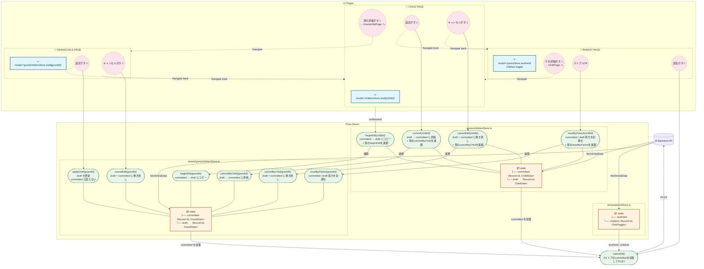

```mermaid
graph TD
    classDef page fill:#e1f5fe,stroke:#01579b,stroke-width:2px;
    classDef store fill:#fff3e0,stroke:#e65100,stroke-width:2px;
    classDef action fill:#e8f5e9,stroke:#2e7d32,stroke-width:1px,stroke-dasharray: 5 5;
    classDef nav fill:#fce4ec,stroke:#c62828,stroke-width:1px,stroke-dasharray: 5 5;

    API[("🌐 Backend API")]

    %% 画面（UI）レイヤー
    subgraph UI_Pages [UI Pages]

        subgraph ParentPage [📱 PARENT PAGE]
            ParentUI["v-model='parentStore.textField'<br>children toggle"]:::page
            NavToChild((子の詳細ボタン<br>→ ChildPage へ)):::nav
            ToggleOff((子トグルOff)):::nav
            Submit((送信ボタン)):::nav
        end

        subgraph ChildPage [📱 CHILD PAGE]
            ChildUI["v-model='childrenStore.draft[childId]'"]:::page
            NavToGrand((孫の詳細ボタン<br>→ GrandchildPage へ)):::nav
            CommitChild((設定ボタン)):::nav
            CancelChild((キャンセルボタン)):::nav
        end

        subgraph GrandchildPage [📱 GRANDCHILD PAGE]
            GrandUI["v-model='grandchildrenStore.draft[grandId]'"]:::page
            ApplyGrand((設定ボタン)):::nav
            CancelGrand((キャンセルボタン)):::nav
        end

    end

    %% ストア（Pinia）レイヤー
    subgraph Pinia_Stores [Pinia Stores]

        subgraph Parent_Scope [stores/parentStore.ts]
            parentStore["📦 state<br>├── textField<br>└── children: Record&lt;id, ChildToggle&gt;"]:::store
        end

        subgraph Child_Scope [stores/childrenStore.ts]
            childrenStore["📦 state<br>├── committed: Record&lt;id, ChildData&gt;<br>└── draft:      Record&lt;id, ChildData&gt;"]:::store
            beginChild(["beginEdit(childId)<br>committed → draft にコピー<br>+ 孫のbeginEditを連鎖"]):::action
            commitChildFn(["commit(childId)<br>draft → committed に昇格<br>+ 孫のcommitByChildを連鎖"]):::action
            cancelChildFn(["cancelEdit(childId)<br>draft = committed に巻き戻し<br>+ 孫のcancelByChildを連鎖"]):::action
            resetChild(["resetByParent(childId)<br>committed / draft 両方を初期化<br>+ 孫のresetByParentを連鎖"]):::action
        end

        subgraph Grand_Scope [stores/grandchildrenStore.ts]
            grandchildrenStore["📦 state<br>├── committed: Record&lt;id, GrandData&gt;<br>└── draft:      Record&lt;id, GrandData&gt;"]:::store
            beginGrand(["beginEdit(grandId)<br>committed → draft にコピー"]):::action
            applyGrandFn(["applyDraft(grandId)<br>draft を更新<br>committed は変えない"]):::action
            commitGrandFn(["commitByChild(grandId)<br>draft → committed に昇格"]):::action
            cancelGrandFn(["cancelEdit(grandId)<br>draft = committed に巻き戻し"]):::action
            cancelByChildFn(["cancelByChild(grandId)<br>draft = committed に巻き戻し"]):::action
            resetGrand(["resetByParent(grandId)<br>committed / draft 両方を初期化"]):::action
        end

    end

    %% --- 初期データ取得 ---
    API -->|fetchInitialData| parentStore
    API -->|fetchInitialData| childrenStore
    API -->|fetchInitialData| grandchildrenStore

    %% --- 親 → 子遷移 ---
    NavToChild -.->|Navigate| ChildPage
    ChildPage -->|onMounted| beginChild
    beginChild --- childrenStore
    beginChild -->|連鎖| beginGrand
    beginGrand --- grandchildrenStore

    %% --- 子 → 孫遷移 ---
    NavToGrand -.->|Navigate| GrandchildPage

    %% --- 孫: 設定 / キャンセル ---
    ApplyGrand --> applyGrandFn
    applyGrandFn --- grandchildrenStore
    ApplyGrand -.->|Navigate back| ChildPage

    CancelGrand --> cancelGrandFn
    cancelGrandFn --- grandchildrenStore
    CancelGrand -.->|Navigate back| ChildPage

    %% --- 子: 設定 / キャンセル ---
    CommitChild --> commitChildFn
    commitChildFn --- childrenStore
    commitChildFn -->|連鎖| commitGrandFn
    commitGrandFn --- grandchildrenStore
    CommitChild -.->|Navigate back| ParentPage

    CancelChild --> cancelChildFn
    cancelChildFn --- childrenStore
    cancelChildFn -->|連鎖| cancelByChildFn
    cancelByChildFn --- grandchildrenStore
    CancelChild -.->|Navigate back| ParentPage

    %% --- 親: トグルOff ---
    ToggleOff --> resetChild
    resetChild --- childrenStore
    resetChild -->|連鎖| resetGrand
    resetGrand --- grandchildrenStore

    %% --- 親: 送信 ---
    Submit --> submitFn(["submitAll()<br>3ストアのcommittedを収集してPOST"]):::action
    parentStore -->|textField / children| submitFn
    childrenStore -->|committed を収集| submitFn
    grandchildrenStore -->|committed を収集| submitFn
    submitFn -->|POST| API
```
