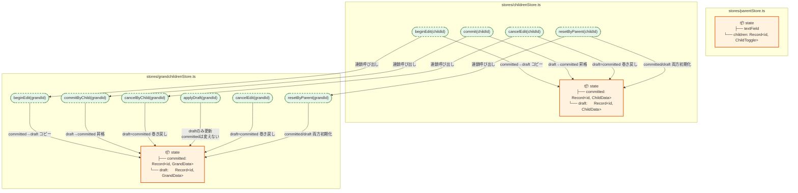

```mermaid
graph TD
classDef store fill:#fff3e0,stroke:#e65100,stroke-width:2px;
classDef method fill:#e8f5e9,stroke:#2e7d32,stroke-width:1px,stroke-dasharray: 5 5;

    subgraph Parent_Scope [stores/parentStore.ts]
        parentState["📦 state<br>├── textField<br>└── children: Record&lt;id, ChildToggle&gt;"]:::store
    end

    subgraph Child_Scope [stores/childrenStore.ts]
        childState["📦 state<br>├── committed: Record&lt;id, ChildData&gt;<br>└── draft:      Record&lt;id, ChildData&gt;"]:::store
        beginChild(["beginEdit(childId)"]):::method
        commitChild(["commit(childId)"]):::method
        cancelChild(["cancelEdit(childId)"]):::method
        resetChild(["resetByParent(childId)"]):::method
    end

    subgraph Grand_Scope [stores/grandchildrenStore.ts]
        grandState["📦 state<br>├── committed: Record&lt;id, GrandData&gt;<br>└── draft:      Record&lt;id, GrandData&gt;"]:::store
        beginGrand(["beginEdit(grandId)"]):::method
        applyGrand(["applyDraft(grandId)"]):::method
        commitGrand(["commitByChild(grandId)"]):::method
        cancelGrand(["cancelEdit(grandId)"]):::method
        cancelByChild(["cancelByChild(grandId)"]):::method
        resetGrand(["resetByParent(grandId)"]):::method
    end

    %% beginEdit 連鎖
    beginChild -->|"committed→draft コピー"| childState
    beginChild -->|"連鎖呼び出し"| beginGrand
    beginGrand -->|"committed→draft コピー"| grandState

    %% commit 連鎖
    commitChild -->|"draft→committed 昇格"| childState
    commitChild -->|"連鎖呼び出し"| commitGrand
    commitGrand -->|"draft→committed 昇格"| grandState

    %% cancelEdit 連鎖
    cancelChild -->|"draft=committed 巻き戻し"| childState
    cancelChild -->|"連鎖呼び出し"| cancelByChild
    cancelByChild -->|"draft=committed 巻き戻し"| grandState

    %% 孫単体のapplyDraft
    applyGrand -->|"draftのみ更新<br>committedは変えない"| grandState

    %% 孫単体のcancelEdit
    cancelGrand -->|"draft=committed 巻き戻し"| grandState

    %% resetByParent 連鎖
    resetChild -->|"committed/draft 両方初期化"| childState
    resetChild -->|"連鎖呼び出し"| resetGrand
    resetGrand -->|"committed/draft 両方初期化"| grandState
```
