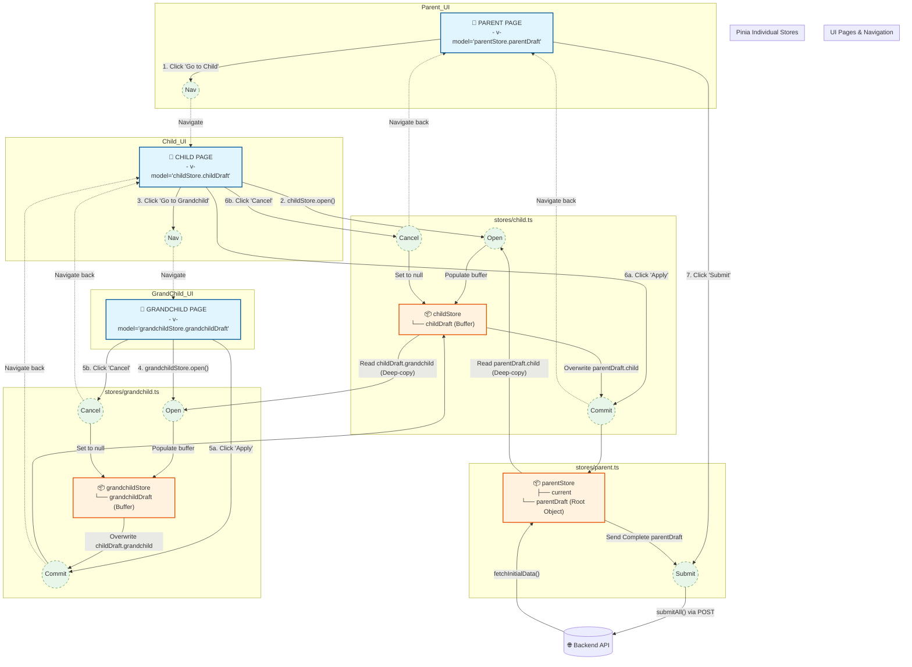

```mermaid
graph TD
    %% スタイルの定義
    classDef page fill:#e1f5fe,stroke:#01579b,stroke-width:2px;
    classDef store fill:#fff3e0,stroke:#e65100,stroke-width:2px;
    classDef action fill:#e8f5e9,stroke:#2e7d32,stroke-width:1px,stroke-dasharray: 5 5;

    %% 画面（UI）レイヤー
    subgraph UI_Pages [UI Pages & Navigation]
    end
    %% ストア（Pinia）レイヤー
    subgraph Pinia_Individual_Stores [Pinia Individual Stores]
    end

        subgraph Parent_UI
          ParentPage["📱 PARENT PAGE<br>- v-model='parentStore.parentDraft'"]:::page
          UI_Nav1
        end
        %% 親ストア
        subgraph Parent_Scope [stores/parent.ts]
            parentStore["📦 parentStore<br>├── current<br>└── parentDraft (Root Object)"]:::store
            SubmitAll
        end

        %% 子ストア
        subgraph Child_UI
          ChildPage["📱 CHILD PAGE<br>- v-model='childStore.childDraft'"]:::page
          UI_Nav2
        end
        subgraph Child_Scope [stores/child.ts]
            childStore["📦 childStore<br>└── childDraft (Buffer)"]:::store
            OpenChild
            CommitChild
            CancelChild
        end

        %% 孫ストア
        subgraph GrandChild_UI
          GrandchildPage["📱 GRANDCHILD PAGE<br>- v-model='grandchildStore.grandchildDraft'"]:::page
        end
        subgraph Grandchild_Scope [stores/grandchild.ts]
            grandchildStore["📦 grandchildStore<br>└── grandchildDraft (Buffer)"]:::store
            OpenGrandchild
            CommitGrandchild
            CancelGrandchild
        end

    %% --- 1. 親階層の初期化 ---
    API[("🌐 Backend API")] -->|"fetchInitialData()"| parentStore

    %% --- 2. 親から子への遷移とデータ取得 ---
    ParentPage -->|"1. Click 'Go to Child'"| UI_Nav1((Nav)):::action
    UI_Nav1 -.->|Navigate| ChildPage
    ChildPage -->|"2. childStore.open()"| OpenChild((Open)):::action
    parentStore -->|"Read parentDraft.child (Deep-copy)"| OpenChild
    OpenChild -->|Populate buffer| childStore

    %% --- 3. 子から孫への遷移とデータ取得 ---
    ChildPage -->|"3. Click 'Go to Grandchild'"| UI_Nav2((Nav)):::action
    UI_Nav2 -.->|Navigate| GrandchildPage
    GrandchildPage -->|"4. grandchildStore.open()"| OpenGrandchild((Open)):::action
    childStore -->|"Read childDraft.grandchild (Deep-copy)"| OpenGrandchild
    OpenGrandchild -->|Populate buffer| grandchildStore

    %% --- 4. 孫から子へのデータ反映 or 破棄 ---
    GrandchildPage -->|"5a. Click 'Apply'"| CommitGrandchild((Commit)):::action
    grandchildStore -->|"Overwrite childDraft.grandchild"| CommitGrandchild
    CommitGrandchild --> childStore
    CommitGrandchild -.->|Navigate back| ChildPage

    GrandchildPage -->|"5b. Click 'Cancel'"| CancelGrandchild((Cancel)):::action
    CancelGrandchild -->|"Set to null"| grandchildStore
    CancelGrandchild -.->|Navigate back| ChildPage

    %% --- 5. 子から親へのデータ反映 or 破棄 ---
    ChildPage -->|"6a. Click 'Apply'"| CommitChild((Commit)):::action
    childStore -->|"Overwrite parentDraft.child"| CommitChild
    CommitChild --> parentStore
    CommitChild -.->|Navigate back| ParentPage

    ChildPage -->|"6b. Click 'Cancel'"| CancelChild((Cancel)):::action
    CancelChild -->|"Set to null"| childStore
    CancelChild -.->|Navigate back| ParentPage

    %% --- 6. 最終一括送信 ---
    ParentPage -->|"7. Click 'Submit'"| SubmitAll((Submit)):::action
    parentStore -->|"Send Complete parentDraft"| SubmitAll
    SubmitAll -->|"submitAll() via POST"| API
```
