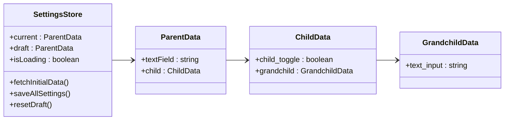
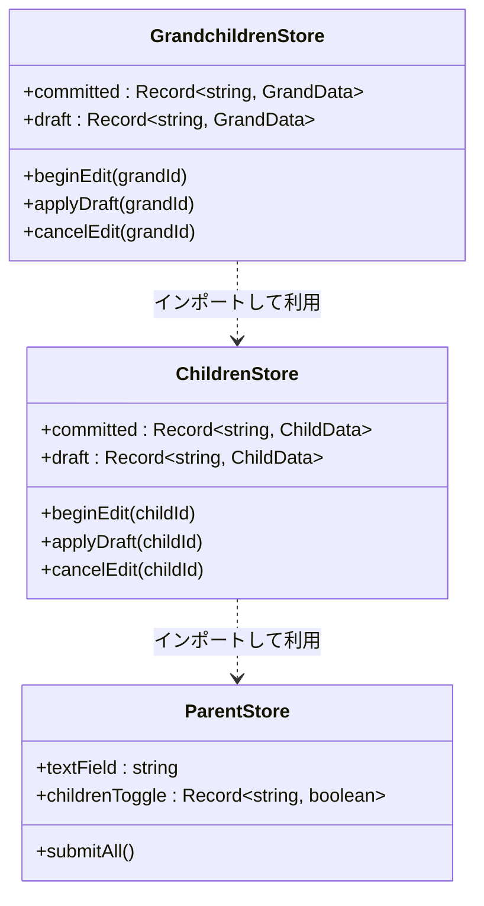
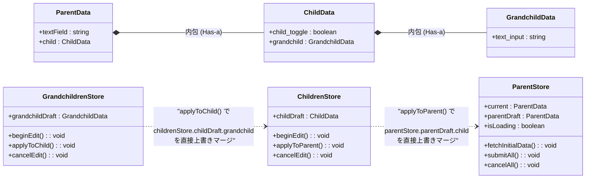

パターン1

パターン2

完全版?

1. 画面を開いたとき (beginEdit)
   1. 下位のストアは、1つ上のストアの draft の中にある自分用のデータをディープコピーして、自身の draft（例: grandchildDraft）を生成します。
      1. 孫を開くとき: childrenStore.childDraft.grandchild ➔ grandchildDraft2.
2. 設定ボタンを押したとき (applyToChild / applyToParent)
   1. 自分の committed を書き換えるのではなく、1つ上のストアの draft 内にある該当オブジェクトに対して、自身の最新 draft を上書きマージします。
   2. 孫の設定: grandchildDraft ➔ childrenStore.childDraft.grandchild
   3. 子の設定: childDraft ➔ parentStore.parentDraft.child3.
3. キャンセルボタンを押したとき (cancelEdit)
   1. 上の階層はまだ一切汚されていない（設定ボタンを押すまで上書きされない）ため、自分の draft（バッファ）を単に null にしてクリアするだけで、確実に1つ前の状態に安全にロールバックします。
4. 最上位の送信ボタンを押したとき (submitAll)
   1. すべての階層の変更がマージされて集約された parentStore.parentDraft を一括でサーバーに送信します。送信が成功した瞬間にのみ、current = parentDraft として全体の確定状態を更新します。
5. この「1つ上の draft を書き換える」アプローチにおいて、Vue（Nuxt 3）の各コンポーネントがストアを呼び出して実行するbeginEdit と applyTo... の具体的なプログラム記述例について詳しく確認しますか？
