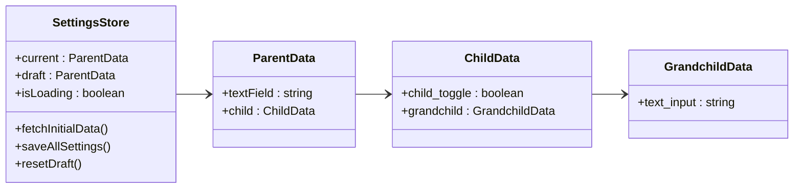
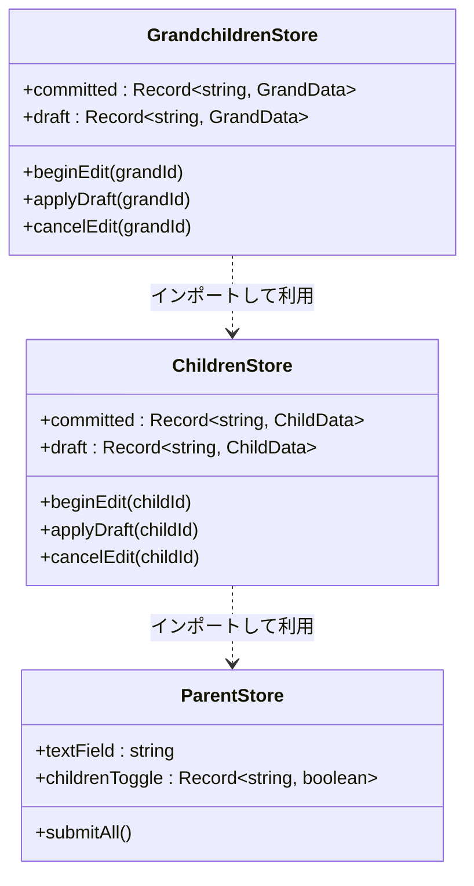
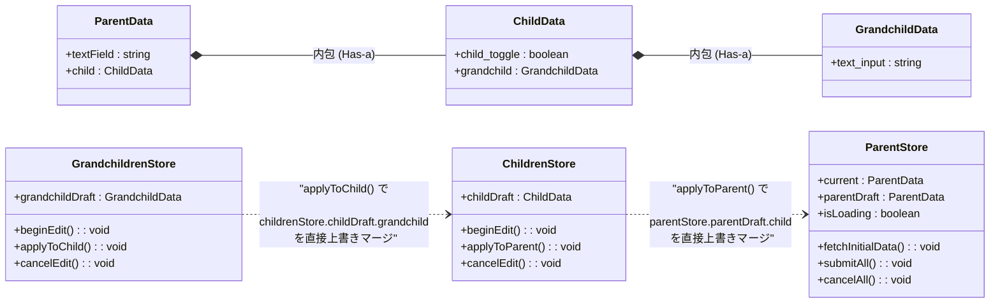

パターン1



パターン2



完全版?



1. 画面を開いたとき (beginEdit)
   1. 下位のストアは、1つ上のストアの draft の中にある自分用のデータをディープコピーして、自身の draft（例: grandchildDraft）を生成します。
      1. 孫を開くとき: childrenStore.childDraft.grandchild ➔ grandchildDraft2.
2. 設定ボタンを押したとき (applyToChild / applyToParent)
   1. 自分の committed を書き換えるのではなく、1つ上のストアの draft 内にある該当オブジェクトに対して、自身の最新 draft を上書きマージします。
   2. 孫の設定: grandchildDraft ➔ childrenStore.childDraft.grandchild
   3. 子の設定: childDraft ➔ parentStore.parentDraft.child3.
3. キャンセルボタンを押したとき (cancelEdit)
   1. 上の階層はまだ一切汚されていない（設定ボタンを押すまで上書きされない）ため、自分の draft（バッファ）を単に null にしてクリアするだけで、確実に1つ前の状態に安全にロールバックします。
4. 最上位の送信ボタンを押したとき (submitAll)
   1. すべての階層の変更がマージされて集約された parentStore.parentDraft を一括でサーバーに送信します。送信が成功した瞬間にのみ、current = parentDraft として全体の確定状態を更新します。
5. この「1つ上の draft を書き換える」アプローチにおいて、Vue（Nuxt 3）の各コンポーネントがストアを呼び出して実行するbeginEdit と applyTo... の具体的なプログラム記述例について詳しく確認しますか？

---

このストアに対して、次のケースのときに何を実行したらよいのか教えてください。

- 回答例
  - 例1: 親からnavigateToで子の編集画面に入るとき
    - タイミング
      - 子のonMounted
    - 実行アクション
      - childrenStore.begenEdit()
  - 例1: 親からnavigateToで子の編集画面に入るとき
    - タイミング
      - 親ページのnavigateTo('子')の実行直前
    - 実行アクション
      - childrenStore.beginEditを実行

- ケース
  - 直接ブラウザのリンクで子ページを指定して遷移(ストアが空)
  - 親から子の編集ボタンクリックしこの画面に遷移(navigateTo)するとき
  - 孫から設定ボタンで子のページに戻るとき
  - 孫からキャンセルボタンで子のページに戻るとき
  - ブラウザの戻る機能をクリックしたとき(設定かキャンセルかわからない)

---

# Gemini回答

各ケースにおける実行アクション一覧

1. 直接ブラウザのリンクで子ページを指定して遷移したとき（ストアが空）
   1. タイミング：子ページの onMounted（または definePageMeta のミドルウェア）
   2. 実行アクション：parentStore.fetchInitialData() を実行して、最上位のベースデータをAPI等から取得。データ取得完了後、連鎖して childrenStore.beginEdit() を実行。
   3. 解説：親ページを経由していないため、ルートの下書き（parentDraft）すら存在しない状態です。まずは親ストアを初期化し、そこから子のバッファを作成させる必要があります。
2. 2. 親から子の編集ボタンをクリックし、子の画面に遷移（navigateTo）するとき
   1. タイミング：親ページ側、navigateTo('子') を実行する直前
   1. 実行アクション：childrenStore.beginEdit()
   1. 解説：画面が切り替わる前に、現在の parentStore.parentDraft.child のスナップショットをディープコピーして childDraft を作成します。これにより、子画面が開いた瞬間にはすでに最新のデータがバッファに詰まっている状態を作れます。
3. 3. 孫から設定ボタンで子のページに戻るとき
   1. タイミング：孫ページ側、[設定] ボタンをクリックしたイベントハンドラー内（navigateTo('子') の直前）
   1. 実行アクション：grandchildrenStore.applyToChild()
   1. 解説：孫が編集した grandchildDraft の内容を、1つ上の childrenStore.childDraft.grandchild に上書きマージ（確定）してから、子画面へ戻ります。
4. 4. 孫からキャンセルボタンで子のページに戻るとき
   1. タイミング：孫ページ側、[キャンセル] ボタンをクリックしたイベントハンドラー内（navigateTo('子') の直前）
   1. 実行アクション：grandchildrenStore.cancelEdit()解説：孫の grandchildDraft を null でクリアし、何も書き戻さずに子画面へ戻ります。1つ上の childrenStore は汚されていないため、安全にロールバックされます。
5. 5. ブラウザの「戻る」機能をクリックしたとき（設定かキャンセルかわからない）
   1. タイミング：離脱しようとしているページ（例: 孫ページ）の onBeforeRouteLeave（Nuxt 3のナビゲーションガード） の中
   1. 実行アクション：grandchildrenStore.cancelEdit()解説：ボタンを介さないブラウザの「戻る」は、システム的には「設定ボタンを押さずに画面を離れた（＝キャンセルと同義）」とみなすのが鉄則です。もし「変更が破棄されますがよろしいですか？」というダイアログを出したい場合は、以下のようにガードを記述します。
   1. 💡 「ブラウザの戻る」に対応するナビゲーションガードの実装例孫ページ（grandchild.vue）での実装コードです。通常のキャンセルボタンだけでなく、ブラウザの「戻る」が押された際も自動で検知してバッファを安全にクレンジングします。

```vue
<script setup ts>
import { onBeforeRouteLeave } from '#app'
import { useGrandchildrenStore } from '~/stores/grandchildrenStore'

const grandchildStore = useGrandchildrenStore()

onBeforeRouteLeave((to, from, next) => {
  // すでに設定ボタンやキャンセルボタンが押されて、バッファがクリアされている場合はそのまま遷移を通す
  if (!grandchildStore.grandchildDraft) {
    return next()
  }

  // ブラウザの「戻る」などで、バッファが残ったまま画面を離れようとした場合
  const confirmLeave = confirm(
    '編集中データは破棄されます。戻ってもよろしいですか？',
  )

  if (confirmLeave) {
    // ユーザーが「はい」を選んだら、下書きを安全に破棄して遷移を許可する
    grandchildStore.cancelEdit()
    next()
  } else {
    // 「いいえ」を選んだら、ページ遷移自体をキャンセルして画面に留まる
    next(false)
  }
})
</script>
```

コードは注意してご使用ください。このように、ユーザーの不規則な画面移動に対しては Vue/Nuxtのライフサイクル（onBeforeRouteLeave）をセーフティネットとして活用 することで、ストアの中に古いゴミデータ（編集中の下書き）が残留するバグを完璧に防ぐことができます。この各ケースの制御を踏まえ、ブラウザの「更新（リロード）」ボタンが押されてPiniaのメモリ状態が完全にリセットされた場合の、LocalStorage等を使ったデータ退避（永続化）の必要性についてさらに詳しく確認しますか？

---

# Claude回答

## 各ケースの対応

---

### 直接ブラウザのリンクで子ページを指定して遷移（ストアが空）

|                    |                                                          |
| ------------------ | -------------------------------------------------------- |
| **タイミング**     | 子の `onMounted`                                         |
| **実行アクション** | `parentStore.load()` → 完了後 `childStore.open(childId)` |

```ts
onMounted(async () => {
  if (!parentStore.draft) {
    await parentStore.load()   // APIからデータ取得
  }
  childStore.open(childId)
})
```

ストアが空の場合は親データを先にロードしてから `buffer` を展開する必要があります。

---

### 親から子の編集ボタンクリックで遷移（navigateTo）

|                    |                            |
| ------------------ | -------------------------- |
| **タイミング**     | `navigateTo` 実行**直前**  |
| **実行アクション** | `childStore.open(childId)` |

```ts
// 親ページ
function onClickChildEdit(childId) {
  childStore.open(childId)     // bufferにdeep copy
  navigateTo(`/child/${childId}`)
}
```

`onMounted` ではなく遷移前に実行する理由は、**ページ遷移アニメーション中にすでにbufferが存在している**状態にするためです。`onMounted` でも動作はしますが、画面描画の一瞬 `buffer = null` の状態が生じてちらつく可能性があります。

---

### 孫から設定ボタンで子のページに戻るとき

|                    |                       |
| ------------------ | --------------------- |
| **タイミング**     | `navigateTo` 実行直前 |
| **実行アクション** | `grandStore.commit()` |

```ts
// 孫ページ
function onClickApply() {
  grandStore.commit()           // buffer → childStore.buffer.grandchildren[id] に書き戻し
  navigateTo(`/child/${childId}`)
}
```

---

### 孫からキャンセルボタンで子のページに戻るとき

|                    |                       |
| ------------------ | --------------------- |
| **タイミング**     | `navigateTo` 実行直前 |
| **実行アクション** | `grandStore.cancel()` |

```ts
// 孫ページ
function onClickCancel() {
  grandStore.cancel()           // buffer を破棄。childStore.buffer は触らない
  navigateTo(`/child/${childId}`)
}
```

---

### ブラウザの戻るボタンをクリックしたとき（設定かキャンセルか不明）

これが最も注意が必要なケースです。

|                    |                                              |
| ------------------ | -------------------------------------------- |
| **タイミング**     | 子・孫ページの `onBeforeRouteLeave`          |
| **実行アクション** | `grandStore.cancel()` を**安全側**として実行 |

```ts
// 孫ページ
onBeforeRouteLeave((to, from, next) => {
  // 設定ボタン経由ならcommit済みなのでbuffer=null
  // キャンセルボタン経由ならcancel済みなのでbuffer=null
  // どちらも未実行（ブラウザバック）の場合のみ実行
  if (grandStore.buffer !== null) {
    grandStore.cancel()         // 安全側（キャンセル扱い）
  }
  next()
})
```

```ts
// 子ページも同様
onBeforeRouteLeave((to, from, next) => {
  if (childStore.buffer !== null) {
    childStore.cancel()         // 安全側（キャンセル扱い）
  }
  next()
})
```

`buffer !== null` のチェックがポイントです。設定・キャンセルボタン経由では **すでに `buffer = null` になっている**ため、`onBeforeRouteLeave` が二重に走っても安全です。

---

## まとめ

| ケース                       | タイミング           | アクション                                 |
| ---------------------------- | -------------------- | ------------------------------------------ |
| 直接URL遷移（ストアが空）    | 子の `onMounted`     | `parentStore.load()` → `childStore.open()` |
| 親から編集ボタンで遷移       | `navigateTo` 直前    | `childStore.open(childId)`                 |
| 孫から設定ボタンで戻る       | `navigateTo` 直前    | `grandStore.commit()`                      |
| 孫からキャンセルボタンで戻る | `navigateTo` 直前    | `grandStore.cancel()`                      |
| ブラウザの戻るボタン         | `onBeforeRouteLeave` | `buffer !== null` なら `cancel()`          |
