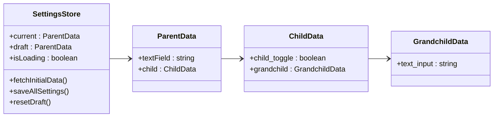
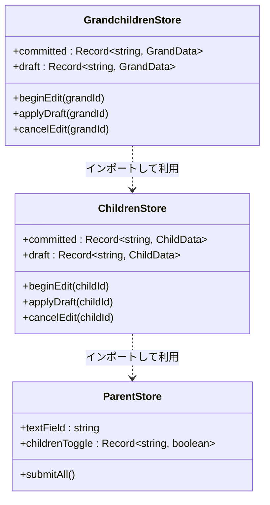
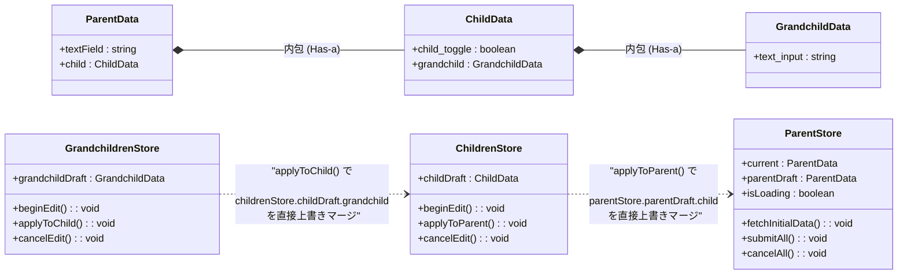

パターン1

```mermaid
classDiagram
    direction LR
    class SettingsStore {
        +current : ParentData
        +draft : ParentData
        +isLoading : boolean
        +fetchInitialData()
        +saveAllSettings()
        +resetDraft()
    }

    class ParentData {
        +textField : string
        +child : ChildData
    }

    class ChildData {
        +child_toggle : boolean
        +grandchild : GrandchildData
    }

    class GrandchildData {
        +text_input : string
    }

    %% 依存関係の表現（丸ごと内包している）
    SettingsStore --> ParentData
    ParentData --> ChildData
    ChildData --> GrandchildData
```

パターン2

```mermaid
classDiagram
    class ParentStore {
        +textField : string
        +childrenToggle : Record~string, boolean~
        +submitAll()
    }

    class ChildrenStore {
        +committed : Record~string, ChildData~
        +draft : Record~string, ChildData~
        +beginEdit(childId)
        +applyDraft(childId)
        +cancelEdit(childId)
    }

    class GrandchildrenStore {
        +committed : Record~string, GrandData~
        +draft : Record~string, GrandData~
        +beginEdit(grandId)
        +applyDraft(grandId)
        +cancelEdit(grandId)
    }

    %% 依存関係（下のストアが、上のストアを呼び出してデータをマージする）
    ChildrenStore ..> ParentStore : インポートして利用
    GrandchildrenStore ..> ChildrenStore : インポートして利用

```

完全版?

```mermaid
classDiagram
    direction LR

    %% -------------------------------------------
    %% 階層1: ParentStore (ルート)
    %% -------------------------------------------
    class ParentStore {
        +current : ParentData
        +parentDraft : ParentData
        +isLoading : boolean
        +fetchInitialData() : void
        +submitAll() : void
        +cancelAll() : void
    }

    class ParentData {
        +textField : string
        +child : ChildData
    }

    %% -------------------------------------------
    %% 階層2: ChildrenStore
    %% -------------------------------------------
    class ChildrenStore {
        +childDraft : ChildData
        +beginEdit() : void
        +applyToParent() : void
        +cancelEdit() : void
    }

    class ChildData {
        +child_toggle : boolean
        +grandchild : GrandchildData
    }

    %% -------------------------------------------
    %% 階層3: GrandchildrenStore
    %% -------------------------------------------
    class GrandchildrenStore {
        +grandchildDraft : GrandchildData
        +beginEdit() : void
        +applyToChild() : void
        +cancelEdit() : void
    }

    class GrandchildData {
        +text_input : string
    }

    %% -------------------------------------------
    %% 関係性の定義
    %% -------------------------------------------
    %% データ構造のネスト関係
    ParentData *-- ChildData : 内包 (Has-a)
    ChildData *-- GrandchildData : 内包 (Has-a)

    %% ストア間の依存・データ書き換えアクション
    ChildrenStore ..> ParentStore : "applyToParent() で<br/> parentStore.parentDraft.child<br /> を直接上書きマージ"
    GrandchildrenStore ..> ChildrenStore : "applyToChild() で<br /> childrenStore.childDraft.grandchild<br /> を直接上書きマージ"
```
