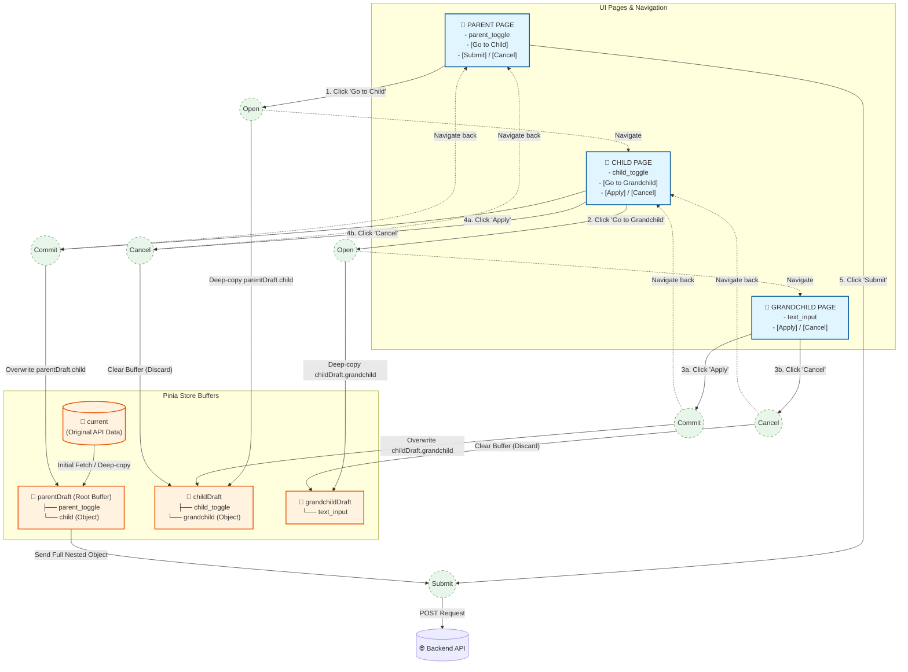
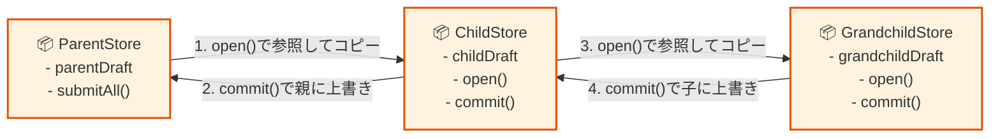

# 指示

Nuxt.jsでアプリ開発してます。

次のような階層構造を持つページにおいて、
Piniaストアをどう使えばよいですか?

---

# 親ページ

- 入力項目
  - テキストフィールド
  - トグルスイッチ
    - 子の機能をOn/Offできる
    - 子は複数いる
    - トグルスイッチOff時は子の範囲のデータを初期化する
- 子の詳細ボタン
  - クリックすると子に遷移する
- 送信ボタン
- キャンセルボタン

## 子ページ

1つの親に対して、複数の子が存在します

- 入力項目
  - テキストフィールド
  - トグルスイッチ
    - 孫の機能をOn/Offできる
    - トグルスイッチOff時は孫の範囲のデータを初期化する(キャンセルで初期化はもとに戻せる。)
- キャンセルボタン
  - 入力データをクリアして親に戻る。
  - ## 孫のデータも、最後に子で設定を行ったときの孫データに戻す。
- 設定ボタン
  - 入力データを設定して親に戻る

### 孫ページ

一つの子に対して、複数の孫が存在します。

- 入力項目
  - テキストフィールドなど
- キャンセルボタン
  - 入力データをクリアして子に戻る。
- 設定ボタン
  - 入力データを設定して子に戻る

---

このような「モーダルダイアログ」や「子画面へのドリルダウン」に近い挙動（確定するまで親に反映させない）を実装する場合、Piniaストア内に各階層専用の「下書き用の一時バッファ（draft）」を用意する設計が最適です。
ユーザーが「設定ボタン」を押したタイミングで初めて、下位階層のデータを上位階層のデータにマージ（マッピング）します。これにより、「キャンセルボタン」を押したときは、その階層のバッファを破棄するだけで元の状態を維持できます。
以下に、この挙動を実現するためのPiniaストアの具体的な構成と実装例を示します。

---

## 1. ストアの全体設計 (stores/settings.ts)

親、子、孫のデータをそれぞれ独立したオブジェクトとして定義します。ポイントは、子や孫の設定画面を開いたときに、「現在の親や子の中にあるデータ」をそれぞれの専用バッファに一度コピーして編集させる点です。

```typescript
import { defineStore } from 'pinia'

// 1. 各階層のデータ型定義
interface GrandchildData {
text: string
}
interface ChildData {
toggle: boolean
grandchild: GrandchildData // 孫のデータを内包
}
interface ParentData {
toggle: boolean
child: ChildData // 子のデータを内包
}
export const useHierarchicalStore = defineStore('hierarchical', () => {
// ----------------------------------------------------
// ステート（状態）
// ----------------------------------------------------
const current = ref<ParentData | null>(null) // APIから取得した確定データ

// 各階層の編集用バッファ（下書き）
const parentDraft = ref<ParentData | null>(null)
const childDraft = ref<ChildData | null>(null)
const grandchildDraft = ref<GrandchildData | null>(null)

// ----------------------------------------------------
// アクション（操作）
// ----------------------------------------------------

// 初期ロード：APIからデータを取得して親バッファにセット
async function fetchInitialData() {
// API取得のダミー
const data: ParentData = {
toggle: false,
child: { toggle: false, grandchild: { text: '' } }
}
current.value = data
parentDraft.value = JSON.parse(JSON.stringify(data))
}

// --- 子階層の操作 ---
function openChild() {
if (!parentDraft.value) return
// 親の下書きの中にある「現在の子のデータ」を子バッファにディープコピー
childDraft.value = JSON.parse(JSON.stringify(parentDraft.value.child))
}

function commitChild() {
if (!parentDraft.value || !childDraft.value) return
// 子バッファの内容を、親の下書きに反映（設定ボタン）
parentDraft.value.child = JSON.parse(JSON.stringify(childDraft.value))
childDraft.value = null // バッファクリア
}

function cancelChild() {
childDraft.value = null // 反映せずにバッファクリア（キャンセルボタン）
}

// --- 孫階層の操作 ---
function openGrandchild() {
if (!childDraft.value) return
// 子の下書きの中にある「現在の孫のデータ」を孫バッファにディープコピー
grandchildDraft.value = JSON.parse(JSON.stringify(childDraft.value.grandchild))
}

function commitGrandchild() {
if (!childDraft.value || !grandchildDraft.value) return
// 孫バッファの内容を、子の下書きに反映（設定ボタン）
childDraft.value.grandchild = JSON.parse(JSON.stringify(grandchildDraft.value))
grandchildDraft.value = null // バッファクリア
}

function cancelGrandchild() {
grandchildDraft.value = null // 反映せずにバッファクリア（キャンセルボタン）
}

// --- 最終一括送信 ---
async function submitAll() {
if (!parentDraft.value) return
// バックエンドへ送信（親Draftがすべての階層の最新変更を持っている状態）
// await $fetch('/api/save', { method: 'POST', body: parentDraft.value })
current.value = JSON.parse(JSON.stringify(parentDraft.value))
alert('すべて一括保存しました')
}

// 全キャンセル（最初に戻す）
function cancelAll() {
if (current.value) {
parentDraft.value = JSON.parse(JSON.stringify(current.value))
}
}

return {
parentDraft, childDraft, grandchildDraft,
fetchInitialData,
openChild, commitChild, cancelChild,
openGrandchild, commitGrandchild, cancelGrandchild,
submitAll, cancelAll
}
})
```

---

## 2. 各ページ・コンポーネントでの実装

データの流れを制御するため、下位階層へ「遷移する直前」または「画面が開いた直後」にOpenアクションを呼ぶのが鉄則です。Nuxtのページ遷移（NuxtLink や navigateTo）やモーダルの開閉イベントと連動させます。

## 親ページ (pages/parent.vue)

```vue
<script setup ts>
import { useHierarchicalStore } from '~/stores/settings'
const store = useHierarchicalStore()
store.fetchInitialData() // 初期化

const goToChild = () => {
  store.openChild() // 子のバッファを作成
  navigateTo('/parent/child') // 子へ遷移
}
</script>

<template>
  <div v-if="store.parentDraft">
    <h1>親設定</h1>
    <input type="checkbox" v-model="store.parentDraft.toggle" /> 親のトグル

    <button @click="goToChild">子の詳細設定へ ＞</button>

    <hr />
    <button @click="store.cancelAll">キャンセル</button>
    <button @click="store.submitAll">送信（一括保存）</button>
  </div>
</template>

## 子ページ (pages/parent/child.vue)

<script setup ts>
import { useHierarchicalStore } from '~/stores/settings'
const store = useHierarchicalStore()

const handleSetting = () => {
  store.commitChild() // 親にデータを反映
  navigateTo('/parent')
}

const handleCancel = () => {
  store.cancelChild() // データを破棄
  navigateTo('/parent')
}

const goToGrandchild = () => {
  store.openGrandchild() // 孫のバッファを作成
  navigateTo('/parent/child/grandchild')
}
</script>

<template>
  <div v-if="store.childDraft">
    <h2>子設定</h2>
    <input type="checkbox" v-model="store.childDraft.toggle" /> 子のトグル

    <button @click="goToGrandchild">孫の詳細設定へ ＞</button>

    <hr />
    <button @click="handleCancel">キャンセル（クリアして戻る）</button>
    <button @click="handleSetting">設定（反映して戻る）</button>
  </div>
</template>

## 孫ページ (pages/parent/child/grandchild.vue)

<script setup ts>
import { useHierarchicalStore } from '~/stores/settings'
const store = useHierarchicalStore()

const handleSetting = () => {
  store.commitGrandchild() // 子にデータを反映
  navigateTo('/parent/child')
}

const handleCancel = () => {
  store.cancelGrandchild() // データを破棄
  navigateTo('/parent/child')
}
</script>

<template>
  <div v-if="store.grandchildDraft">
    <h3>孫設定</h3>
    <input type="text" v-model="store.grandchildDraft.text" /> 孫のテキスト

    <hr />
    <button @click="handleCancel">キャンセル（クリアして戻る）</button>
    <button @click="handleSetting">設定（反映して戻る）</button>
  </div>
</template>
```

---

## 💡 設計のメリット

- 関心の分離：各ページは自分専用の Draft（childDraft など）だけを v-model で見ればよいため、コードが非常にシンプルになります。
- 安全なキャンセル：孫でどれだけ値を書き換えても、「設定」を押さない限りは子に影響を与えません。同様に、子が「設定」を押さない限り親には一切影響しません。

この構成において、ブラウザの「戻る」ボタンを押された場合にも不整合（バッファが残り続ける問題）を防ぐためのナビゲーションガードの設定方法について詳しく確認しますか？

---

テキストによるデータの流れと、画面遷移に伴うPiniaストア内の挙動を図解します。
この設計のポイントは、「遷移時にデータを専用バッファ（Draft）にコピーし、設定ボタンで上の階層へ書き戻す（マージする）」という点です。

---

## 1. 全体像：画面遷移とデータのコピー・マージの流れ

【 画面遷移 】　　　　　[ 親ページ ]　　 ─── 遷移(Open) ──> 　　[ 子ページ ]　　 ─── 遷移(Open) ──> 　　[ 孫ページ ]
　　　　　　　　　　　　　 │　▲　　　　　　　　　　　　　　　　　 │　▲　　　　　　　　　　　　　　　　　 │
───────────────────────────┼───┼─────────────────────────────────┼───┼─────────────────────────────────┼────────────────
【 Piniaストア内 】　　　 │ │ │ │ │
▼ │ [設定]ボタンで反映 ▼ │ [設定]ボタンで反映 │
┌─────────────────────────────────┐ │ (Commit) ┌─────────────────────┐ │ (Commit) ┌─────────────────────┐ │
│ parentDraft │───┼──────────>│ childDraft │───┼──────────>│ grandchildDraft │──┘
│ ┌─────────────────────────────┐ │ │ │ ┌─────────────────┐ │ │ │ ┌─────────────────┐ │
│ │ 親の入力（トグル等） │ │ │ │ │ 孫のデータ │ │ │ │ │ テキスト等の入力│ │
│ └─────────────────────────────┘ │ │ │ └─────────────────┘ │ │ │ └─────────────────┘ │
│ ┌─────────────────────────────┐ │ │ │ │ │ │ │
│ │ child (子データのコピー) │ │ │ └─────────────────────┘ │ └─────────────────────┘
│ │ ┌─────────────────────────┐ │ │ │ │
│ │ │ 子の入力（トグル等） │ │ │ │ ┌─────────────────────┐ │ ┌─────────────────────┐
│ │ └─────────────────────────┘ │ │ └─── 戻る ───│ [キャンセル] ボタン │ └─── 戻る ───│ [キャンセル] ボタン │
│ │ ┌─────────────────────────┐ │ │ │ │ │ │
│ │ │ grandchild (孫コピー) │ │ │ │ ※バッファをクリア │ │ ※バッファをクリア │
│ │ └─────────────────────────┘ │ │ │ してデータを破棄 │ │ してデータを破棄 │
│ └─────────────────────────────┘ │ └─────────────────────┘ └─────────────────────┘
└─────────────────────────────────┘
│ ▲
│ │ [キャンセル] で初期状態に戻す
▼ │
┌─────────────────────────────────┐
│ [送信] ボタン │
│ │
│ ※ parentDraft の最新状態を │
│ APIでサーバーへ一括送信！ │
└─────────────────────────────────┘

---

## 2. 各ボタンを押したときの挙動（詳細ステップ）## 🟢 「子・孫の詳細設定へ」進むとき (Open)

上の階層が持っている現在のデータを、下位階層の専用バッファへディープコピーします。

- 親 ➔ 子：parentDraft.child の中身を、独立した childDraft にコピー。
- 子 ➔ 孫：childDraft.grandchild の中身を、独立した grandchildDraft にコピー。

## 🔵 「設定ボタン」で戻るとき (Commit)

現在編集していたバッファのデータを、一つ上の階層の該当箇所に上書き（マージ）して戻ります。

- 孫 ➔ 子：childDraft.grandchild に grandchildDraft を上書き。
- 子 ➔ 親：parentDraft.child に childDraft を上書き。

## 🔴 「キャンセルボタン」で戻るとき (Cancel)

編集していたバッファを空（null）にして破棄し、上の階層へ戻ります。

- 上の階層（親や子）のデータは一切書き換わらないため、安全に元の状態がキープされます。

## 🚀 親ページの「送信ボタン」を押したとき (Submit)

## 最終的に、すべての階層の変更結果が内包されている parentDraft のオブジェクトをそのまま一括でAPI送信します。

このデータ構造にすることで、コンポーネント側は自分の階層の Draft 変数だけを監視すればよくなり、「設定時は反映、キャンセル時は無視」という業務システムに必須の複雑なライフサイクルをシンプルに実現できます。
次は、このバッファ構造を応用して「どこが変更されたか」を画面上で一目でわかるようにする「変更ハイライト（差分表示）」の実装アプローチについて詳しく確認しますか？

```
===================================================================================
 [UI PAGE LEVEL]        [PINIA BUFFER LEVEL]             [DATA MUTATION RULE]
===================================================================================

  PARENT PAGE              parentDraft
 ┌───────────┐            ┌───────────────┐
 │ [Toggle]  │<──v-model──│ parent_toggle │
 │           │            │               │
 │ [Go to]───┼───(Open)──>│ child         │───┐ (Deep-copy data into childDraft)
 └───────────┘            └───────────────┘   │
       ▲                          ▲           ▼
       │                          │      [CHILD PAGE]
       │                       (Commit) ┌───────────┐
       │                          │     │ [Toggle]  │<──v-model──┐
       │                          │     │           │            │
       └────────(Back to Parent)──┴─────│ [Go to]   │            │
                                        └───────────┘            │
                                              │                  │
                                           (Open)             (v-model)
                                              │                  │
                                              ▼                  ▼
                                         [GRANDCHILD]       childDraft
                                        ┌───────────┐      ┌───────────────┐
                                        │ [Text]    │<────>│ child_toggle  │
                                        │           │      │               │
                                        │ [Apply]   │      │ grandchild    │──┐
                                        │ [Cancel]  │      └───────────────┘  │
                                        └───────────┘                         │
                                              │                               │
                                           (Commit)                        (Open)
                                              │                               │
                                              ▼                               ▼
                                        grandchildDraft <─────────────────────┘
                                       ┌───────────────┐
                                       │ text_input    │
                                       └───────────────┘
                                              │
                                   (Cancel = Set to null)
                                              ▼
                                      [Discard Changes]
```



各階層ごとにストア（useParentStore, useChildStore, useGrandchildStore）を個別に分けるアプローチも非常に優れています。
特に、業務システムが大規模化し、各階層の入力項目が数十個以上に増える場合は、1つのストアにすべてを詰め込むよりもコードの保守性や再利用性が劇的に向上します。
個別ストア構成のメリット・デメリットと、綺麗にデータを連携させるための設計パターンをまとめました。

---

## 1. 個別ストア構成のメリット

- カプセル化とコードのクリーン化
  各階層のページは、自分に対応するストアだけをインポートして使えばよくなります。1つのファイルが肥大化（ファットストア化）するのを防げます。
- コンポーネントの再利用性が高まる
  例えば「子ページ（ユーザー設定）」を、他の画面（プロジェクト管理など）の裏側でも使い回したい場合、ストアが独立していればそのまま移植できます。
- ライフサイクル管理（クレンジング）が容易
  Piniaの $reset() や、ページ離ねる際のアクションで「自分自身のストアの初期化」を呼ぶだけでよいため、他階層への影響度を気にせず綺麗にメモリを解放できます。

---

## 2. ストア間のデータ連携パターン（図解）

個別に分ける場合の最大のポイントは、「子や孫のストアが、どうやって上の階層のデータを参照・マージするか」です。
Piniaでは、ストアの中で別のストアを呼び出して直接連携することが公式に認められています。



---

## 3. 具体的な実装コード例## 孫ストア (stores/grandchild.ts)

子ストア（useChildStore）をインポートし、開くとき（open）と確定するとき（commit）に子ストアのデータを直接操作します。

```ts
import { defineStore } from 'pinia'
import { useChildStore } from './child' // 子ストアをインポート

export const useGrandchildStore = defineStore('grandchild', () => {
  const childStore = useChildStore() // 子ストアのインスタンス化
  const grandchildDraft = ref<{ text: string } | null>(null)

  // 1. 孫画面を開く：子ストアが今持っている孫データをコピー
  function open() {
    if (childStore.childDraft) {
      grandchildDraft.value = JSON.parse(JSON.stringify(childStore.childDraft.grandchild))
    }
  }

  // 2. 確定ボタン：子ストアの該当箇所に自分自身のデータを上書きマージ
  function commit() {
    if (childStore.childDraft && grandchildDraft.value) {
      childStore.childDraft.grandchild = JSON.parse(JSON.stringify(grandchildDraft.value))
      grandchildDraft.value = null // 自身のバッファはクリア
    }
  }

  function cancel() {
    grandchildDraft.value = null
  }

  return { grandchildDraft, open, commit, cancel }
})
```

## 子ストア (stores/child.ts)

同様に、親ストア（useParentStore）をインポートしてデータをマージします。

```ts
import { defineStore } from 'pinia'
import { useParentStore } from './parent' // 親ストアをインポート

export const useChildStore = defineStore('child', () => {
  const parentStore = useParentStore()
  const childDraft = ref<{ toggle: boolean; grandchild: any } | null>(null)

  function open() {
    if (parentStore.parentDraft) {
      childDraft.value = JSON.parse(JSON.stringify(parentStore.parentDraft.child))
    }
  }

  function commit() {
    if (parentStore.parentDraft && childDraft.value) {
      parentStore.parentDraft.child = JSON.parse(JSON.stringify(childDraft.value))
      childDraft.value = null
    }
  }

  function cancel() {
    childDraft.value = null
  }

  return { childDraft, open, commit, cancel }
})

```

```ts
import { defineStore } from 'pinia'

// システム全体のネストされたデータ構造の型定義
interface ParentData {
  toggle: boolean
  child: {
    toggle: boolean
    grandchild: {
      text: string
    }
  }
}

export const useParentStore = defineStore('parent', () => {
  // ----------------------------------------------------
  // State（状態）
  // ----------------------------------------------------
  const current = ref<ParentData | null>(null)     // サーバーにある確定データ
  const parentDraft = ref<ParentData | null>(null) // 画面全体の変更を保持するルート下書き
  const isLoading = ref(false)

  // ----------------------------------------------------
  // Actions（操作）
  // ----------------------------------------------------

  // 1. 画面初期化時にAPIからデータを取得し、下書きのベースを作る
  async function fetchInitialData() {
    isLoading.value = true
    try {
      // APIコールのダミー（実際は $fetch 等に置き換え）
      const data: ParentData = {
        toggle: false,
        child: {
          toggle: false,
          grandchild: { text: '' }
        }
      }
      current.value = data
      // 参照を切るためにディープコピーして下書きへセット
      parentDraft.value = JSON.parse(JSON.stringify(data))
    } catch (error) {
      console.error('データの取得に失敗しました', error)
    } finally {
      isLoading.value = false
    }
  }

  // 2. [送信] ボタン：子や孫からすべてマージされた最終結果をAPIへ一括送信
  async function submitAll() {
    if (!parentDraft.value) return

    isLoading.value = true
    try {
      // サーバーへ送信（子・孫のデータも parentDraft の中にすべて内包されています）
      // await $fetch('/api/settings', { method: 'POST', body: parentDraft.value })

      // 送信成功したら、現在の本番データを更新
      current.value = JSON.parse(JSON.stringify(parentDraft.value))
      alert('すべての階層の設定を一括保存しました')
    } catch (error) {
      console.error('一括保存に失敗しました', error)
    } finally {
      isLoading.value = false
    }
  }

  // 3. [親キャンセル] ボタン：すべての編集を破棄して、APIから取得した初期状態に戻す
  function cancelAll() {
    if (current.value) {
      parentDraft.value = JSON.parse(JSON.stringify(current.value))
    }
  }

  // ----------------------------------------------------
  // Getters（変更検知）
  // ----------------------------------------------------

  // システム全体（親・子・孫のどこか）に未保存の変更があるかを判定
  const hasAnyChanges = computed(() => {
    if (!current.value || !parentDraft.value) return false
    return JSON.stringify(current.value) !== JSON.stringify(parentDraft.value)
  })

  return {
    current,
    parentDraft,
    isLoading,
    fetchInitialData,
    submitAll,
    cancelAll,
    hasAnyChanges
  }
})
```

---

## ⚠️ 個別ストア化するときの注意点（デメリット）

- 依存関係の循環（Circular Dependency）に注意
  「親が子を呼び、子が親を呼ぶ」という双方向のインポート（循環参照）をしてしまうと、Nuxt（Vite）がビルドエラーを起こしたり、ランタイムでクラッシュしたりします。
- 対策：矢印の方向を常に「下位ストアから上位ストアへ向ける（インポートする）」というルールを徹底してください。親ストアは子ストアの存在を一切知らなくてよい（インポートしない）設計にするのが鉄則です。
- 状態の初期化漏れ
  ユーザーが途中でブラウザの「戻る」などで画面をデタラメに遷移した際、childDraft や grandchildDraft に古いデータが残ったままになるリスクがあります。
  Nuxtの onBeforeRouteLeave や、各ページの onMounted で確実に各ストアの cancel() や open() を発火させて状態をクレンジングする必要があります。

設定項目や業務ロジックの行数（規模感）は、現時点でどれくらいになりそうな想定ですか？
